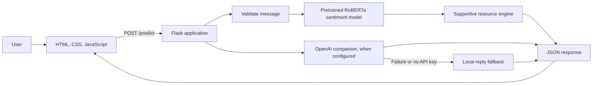

# MindEasy

MindEasy is a small web application for writing a personal check-in and receiving a reflection on its expressed sentiment. It labels text as **positive**, **neutral**, or **negative**, then displays a short supportive reply and optional wellbeing resources.

MindEasy is an educational prototype. It is not a medical device, therapist, diagnostic tool, or crisis service, and its sentiment result is not a clinical assessment.

## What the Application Does

1. The user writes a check-in of up to 2,000 characters in the browser.
2. The Flask server validates the message and runs sentiment prediction using the pretrained `cardiffnlp/twitter-roberta-base-sentiment-latest` model from Hugging Face Transformers.
3. A separate rule-based response engine selects supportive wording and resources based on the sentiment and a few message themes.
4. For non-safety messages, the companion can use the OpenAI Responses API to write a conversational reply. If no key is configured or the API request fails, a local fallback reply is used.
5. The browser displays the sentiment, reply, reflection prompt, breathing exercise, and Spotify search link.



## Features

- A responsive check-in page with a character counter, input validation, and a new-check-in control.
- Three-class sentiment prediction with a confidence score from the pretrained transformer model.
- Supportive, non-clinical replies and rotating quotes, breathing exercises, and Spotify search suggestions.
- Optional conversational replies through the OpenAI Responses API, with a local fallback.
- A phrase-based safety-sensitive response with clear limits. It is not a crisis detector.
- A separate offline training and evaluation script for comparing classical TF-IDF models on the included sample dataset.

## Technology

- **Backend:** Python 3.10, Flask
- **Live sentiment model:** Hugging Face Transformers and PyTorch
- **Optional companion:** OpenAI Python SDK and python-dotenv
- **Offline training/evaluation:** pandas, scikit-learn, joblib, and matplotlib
- **Frontend:** Jinja HTML template, CSS, and vanilla JavaScript

## Requirements

- Python 3.10 
- Internet access the first time the pretrained Hugging Face model needs to be downloaded (unless it is already cached)
- An OpenAI API key only if you want provider-generated companion replies; local fallback replies work without one

## Install and Run

From the project directory, create and activate a virtual environment, then install dependencies:

```bash
python -m venv .venv
source .venv/bin/activate
python -m pip install --upgrade pip
python -m pip install -r requirements.txt
```

Start the Flask application:

```bash
python app.py
```

Open <http://127.0.0.1:5000> in a browser. On first startup, Transformers may download the sentiment model, so startup can take longer and requires network access. The app does not need to run the training script before starting; live sentiment uses the pretrained transformer model.

### Optional OpenAI Companion

The app can run without OpenAI credentials and will use local fallback replies. To enable the API-backed companion:

1. Copy `.env.example` to a file named `.env` in the project root.
2. Replace the placeholder `OPENAI_API_KEY` value with your own API key.
3. Set `OPENAI_MODEL` to a model available to your OpenAI account.
4. Restart the Flask application.

Keep `.env` private and do not submit or commit it. The browser does not receive the API key.

## API Endpoints

| Method | Path | Purpose |
| --- | --- | --- |
| `GET` | `/` | Serves the check-in page. |
| `POST` | `/predict` | Accepts JSON containing a non-empty `text` value and returns sentiment, confidence, a reply, and supportive resources. Messages over 2,000 characters are rejected. |
| `POST` | `/reset` | Clears the current conversation and resource rotation state. |

Example request to `/predict`:

```json
{
	"text": "I finished a difficult assignment and feel relieved."
}
```

The prediction response includes the sentiment label and confidence, plus response and resource fields such as `message`, `quote`, `exercise`, `music`, and `safety`.

## Dataset and Evaluation

`data/dataset.csv` is a small educational dataset with `text` and `label` columns. The current copy contains 120 examples, balanced across positive, neutral, and negative labels. It is used by the offline classical-model training script; the live application does not train on this dataset at startup.

To run the separate training and evaluation workflow:

```bash
python src/train.py
```

The script removes duplicate examples, normalizes text, makes an 80/20 stratified train/test split, and compares Logistic Regression, Multinomial Naive Bayes, and Linear SVM over TF-IDF features. It selects the candidate with the highest weighted F1 score and writes the model artifacts and evaluation outputs listed below.

The checked-in `evaluation/evaluation_report.txt` reports results for the current sample run: Multinomial Naive Bayes was selected with 0.750 accuracy and 0.748 weighted F1 on a 24-example test split. This is a small test set and should not be treated as evidence of clinical accuracy or broad real-world performance. These classical-model metrics describe the offline training experiment, **not** the pretrained RoBERTa model used for live predictions.

## Project Files

```text
mindeasy/
├── app.py                          Flask application and HTTP routes
├── requirements.txt                Python package dependencies
├── .env.example                    Example names for optional API settings
├── .gitignore                      Excludes local environment, cache, and secrets
├── data/
│   └── dataset.csv                 Labeled examples for offline model training
├── evaluation/
│   ├── evaluation_report.txt       Metrics and classification report from training
│   └── confusion_matrix.png        Visual summary of evaluation predictions
├── models/
│   ├── model.pkl                   Saved classical model from offline training
│   └── vectorizer.pkl              Saved TF-IDF vectorizer from offline training
├── public/
│   ├── script.js                   Browser interactions and API requests
│   └── style.css                   Responsive page styling
├── src/
│   ├── __init__.py                 Marks src as a Python package
│   ├── companion.py                OpenAI companion and local reply fallback
│   ├── predict.py                  Loads and calls the pretrained sentiment model
│   ├── preprocessing.py            Text normalization for offline training
│   ├── response_engine.py          Supportive replies and resource selection
│   └── train.py                    Offline TF-IDF model training and evaluation
└── templates/
		└── index.html                  Main page template
```

The Hugging Face model is identified by its model name in `src/predict.py` and is downloaded or loaded from the machine's Transformers cache. The `.venv/`, `.env`, Python cache files, and pytest cache are local or generated items and are not application source files.

## Privacy, Safety, and Limitations

- The app keeps a short conversation history and resource rotation state in Flask's session. Flask's default session is stored in a signed browser cookie; it is not encrypted. Do not enter identifying or highly sensitive information.
- When OpenAI is configured, recent conversation messages are sent to the configured OpenAI model to generate a reply. Review the provider's current privacy and data-handling terms before using real personal information.
- The phrase-based safety pathway checks only a small set of phrases. It can miss risk or flag text incorrectly and must not be relied on in an emergency. Anyone in immediate danger should contact local emergency services or local crisis support and a trusted person.
- Sentiment models can misunderstand sarcasm, slang, short messages, mixed emotions, and context. A prediction is only an estimate of language tone, not a judgement about a person.
- The Flask secret key in `app.py` is a development placeholder. Replace it with a private, securely configured key before any deployment beyond local use; do not treat this prototype as production-ready.

## Troubleshooting

- **Model download or startup is slow:** The pretrained sentiment model may need to download on the first run. Check network access and try starting the app again after the download completes.
- **The app reports missing Python packages:** Activate the intended virtual environment and rerun `python -m pip install -r requirements.txt`.
- **OpenAI replies are unavailable:** Check the private `.env` configuration and account access. The application should still return a local fallback reply if the provider request fails.
- **Port 5000 is already in use:** Stop the other local process using that port, then run `python app.py` again.
